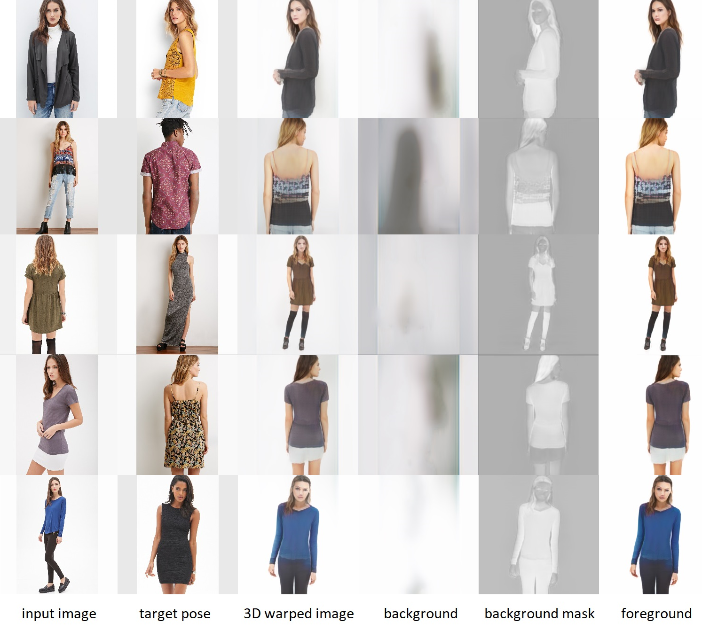

# 3d Pose Warping

Implementing GAN based reposing of an image of a human into any desired novel pose based on the algorithm provided in the paper [here](https://arxiv.org/pdf/2006.04898.pdf). To generate the desired pose, dense feature voxels are implicitly learned from the given 2D poses and then these voxels are warped according to the desired poses. After obtaining the desired 3D feature volume, these voxels are converted back to 2D space using a convolutional decoder.

    
## Screenshots

  
## Demo

Link to Google Colaboratory notebook for demo of this project: [Click here](https://colab.research.google.com/github/kaushik3012/3d-pose-warping/blob/master/3DPoseWarping_Final.ipynb)

  
## Dependencies

- tensorflow-gpu v1.12
- TF-GAN
- scikit-image
- OpenCV3
- Numpy v1.16

  
## Documentation
Link to Documentation:
[Click here](misc/documentation.pdf)

  
## Team

- [Atirek](https://www.github.com/Atirek04)
- [Kaif Faiyaz](https://www.github.com/KaifFaiyaz)
- [Kaushik Raj](https://www.github.com/kaushik3012)
- [Kevin](https://www.github.com/Kevin1732)
- [Maurya](https://www.github.com/Maurya73J)
- [Nikita](https://www.github.com/nikitach5)
- [Prateek Sogra](https://www.github.com/Fullstackmystic)
- [Saksham](https://www.github.com/sakshamar20)
- [Saransh](https://www.github.com/saranshg20)
- [Shakshi](https://www.github.com/Shakshi17012)
- [Shubham Kumar](https://www.github.com/Kshubham20)
  
## Acknowledgements
- [Prakhar Maheshwari](https://www.github.com/harpArk614) (Our Mentor)
- [Markus Knoche and Istv\'an S\'ar\'andi and Bastian Leibe](https://arxiv.org/pdf/2006.04898.pdf) (Original research work)
